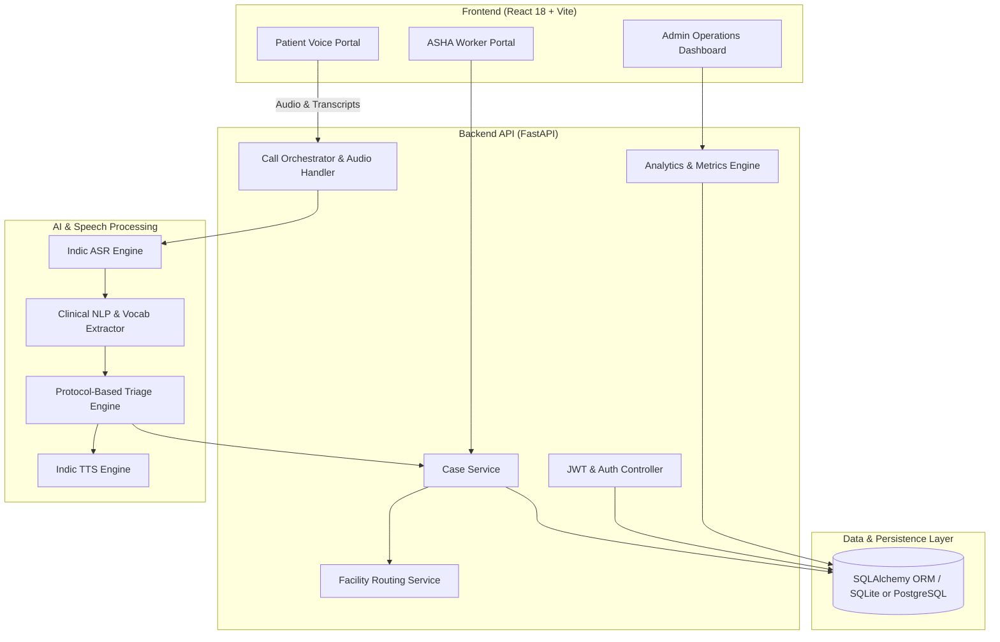

# VaaniDoc

> **VaaniDoc is a voice-first AI care-coordination platform that turns a patient's spoken health concern into a structured care journey — from assessment and triage to local healthcare navigation, ASHA follow-up, and outcome tracking.**

---

## 1. Problem

Accessing timely, reliable healthcare guidance remains a severe challenge across India's rural and semi-urban regions:

- **Linguistic Barriers**: Millions of citizens communicate primarily in regional languages and colloquial dialects (such as Hindi, Bhojpuri, or mixed Hinglish) where traditional text-heavy digital health apps fail.
- **Triage & Misclassification Gap**: Patients often either ignore early warning signs until they become life-threatening emergencies or crowd district tertiary hospitals with routine ailments that could be safely managed at local Primary Health Centres (PHCs).
- **Broken Care Coordination**: Once advice is given, patients are rarely tracked. There is no automated bridge connecting the initial consultation with local community health workers (ASHAs) for home visits, medication checks, and recovery follow-ups.

---

## 2. Solution

VaaniDoc provides an end-to-end voice-first healthcare coordination platform:

- **For Patients**: Speak naturally about symptoms via browser microphone in Hindi, English, or Hinglish. Receive immediate voice-guided reassurance, structured triage levels, direct routing to verified district healthcare facilities (PHC, CHC, Hospital), and case tracking.
- **For ASHA Community Workers**: An action-oriented portal organizing field duties into actionable queues (*Urgent*, *Due Today*, *Active*, *Completed*) with clear clinical checklists, warning signs, and one-click follow-up logging.
- **For Health Operations Administrators**: A dark-themed operations dashboard with real-time KPI metrics, live consultation monitoring, triage distribution, symptom surveillance, and district activity analytics.

---

## 3. Core Workflow

```
Patient Spoken Concern
      │
      ▼
Voice Consultation (Browser Microphone Capture)
      │
      ▼
Speech & Language Understanding (Indic ASR & Multilingual Detection)
      │
      ▼
Structured Symptom Assessment (Clinical NLP & Negation Handling)
      │
      ▼
Protocol-Based Triage (Deterministic 4-Level Severity Classification)
      │
      ▼
Care Recommendation & Voice TTS Guidance
      │
      ▼
Healthcare Facility Navigation (Strict District Isolation)
      │
      ▼
ASHA / Community Coordination (Automated Task Queues)
      │
      ▼
Follow-up & Outcome Tracking (24-Hour Recovery Logging)
```

---

## 4. Key Features

- **Voice-First Patient Consultation**: Real-time browser audio recording, live waveform visualizer, and instant speech processing.
- **Multilingual Speech & Language Handling**: Automatic detection of Hindi, English, and Hinglish code-switching without requiring manual language toggles.
- **Structured Symptom Extraction**: Identifies primary complaints, durations, severity markers, and handles negative assertions (e.g., *"fever but no vomiting"*).
- **Deterministic Protocol Triage**:
  - **Level 1 (Home Care)**: Self-limiting symptoms managed with supportive home care.
  - **Level 2 (PHC Referral)**: Non-urgent clinical conditions routed to the nearest Primary Health Centre within 24–48 hours.
  - **Level 3 (Hospital Referral)**: Moderate-to-severe symptoms requiring Community Health Centres (CHCs) or Sub-District Hospitals.
  - **Level 4 (Emergency)**: Red-flag critical symptoms triggering immediate 108 ambulance escalation.
- **District-Based Healthcare Facility Navigation**: Strictly isolates facility lookups to the patient's currently selected district across verified government PHCs, CHCs, and District Hospitals.
- **Persistent Care Cases**: Generates human-readable tracking identifiers (e.g., `VD-1042`) with full timeline event audit trails.
- **ASHA Follow-Up Workflow**: Task-focused workflow enabling ASHA workers to review case backgrounds, verify danger signs, and mark home visits complete.
- **Follow-up & Outcome Tracking**: Tracks patient recovery status (*Recovered*, *Visited PHC*, *Visited Hospital*, *Escalated*).
- **Admin Health-Operations Dashboard**: Operations dashboard monitoring live active calls, case trends, symptom surveillance, and district-wise referral rates.
- **Role-Based Access Control**: Strict separation between public patient consultations, authenticated patient histories, and authenticated ASHA/Admin operational portals.

---

## 5. AI Architecture & Safety Principle

> **Core Engineering Principle**:
> *AI is used for natural-language and speech understanding, while safety-critical triage and escalation decisions are governed by structured protocol logic.*

```
┌─────────────────────────────────────────────────────────────┐
│                    PROBABILISTIC AI LAYER                   │
│                                                             │
│  • Automatic Speech Recognition (Indic ASR / Wav2Vec)       │
│  • Multilingual & Hinglish Language Detection               │
│  • Clinical NLP Tokenization & Entity Extraction            │
└──────────────────────────────┬──────────────────────────────┘
                               │
                               ▼
┌─────────────────────────────────────────────────────────────┐
│                 DETERMINISTIC CLINICAL LAYER                │
│                                                             │
│  • Rule-Based Protocol Matching                             │
│  • Red-Flag Danger Sign Escalation                          │
│  • 4-Level Strict Triage Classification                     │
│  • Geographical District Invariant Routing                  │
└─────────────────────────────────────────────────────────────┘
```

- **Speech Recognition (ASR)**: Uses Indic acoustic processing with fallback to browser Web Speech API for high accessibility.
- **Clinical NLP**: Extracts symptoms, onset duration, and body locations using structured clinical vocabularies while accurately handling negation rules.
- **Safety Gate**: LLMs or probabilistic models never independently assign triage urgency or prescribe medications; all clinical decisions follow verified protocol logic.

---

## 6. System Architecture



---

## 7. Tech Stack

- **Frontend**:
  - React 18
  - Vite
  - Lucide React Icons
  - Pure Vanilla CSS (Responsive Dark & Light Design System)
- **Backend**:
  - Python 3.12
  - FastAPI (Asynchronous REST API)
  - Pydantic v2 (Schema Validation)
  - SQLAlchemy ORM
  - Uvicorn (ASGI Server)
- **Speech & AI**:
  - Indic Speech Processing & gTTS (Voice Synthesis)
  - Indic NLP & Symptom Extraction Vocabulary
  - Deterministic Protocol Triage Engine
- **Database & Storage**:
  - SQLite (Local development default)
  - PostgreSQL (Production ready via Docker)
- **Security**:
  - Passlib & Bcrypt (Password Hashing)
  - Python-JOSE (JWT Token Generation)
  - CORS Middleware

---

## 8. Repository Structure

```
VaaniDoc/
├── backend/
│   ├── app/
│   │   ├── ai/                # ASR, NLP symptom extraction, Triage, TTS
│   │   ├── api/               # FastAPI routers (auth, calls, cases, asha, analytics, facilities)
│   │   ├── config/            # Pydantic Settings & environment configuration
│   │   ├── database/          # SQLAlchemy session & base setup
│   │   ├── languages/         # Language registry & Hinglish detector
│   │   ├── models/            # SQLAlchemy ORM database models
│   │   ├── schemas/           # Pydantic request/response schemas
│   │   ├── services/          # Core orchestrator, case service, facility router
│   │   └── telephony/         # Audio capture & retention management
│   ├── tests/                 # Comprehensive Pytest test suite (28 tests)
│   ├── Dockerfile             # Backend container configuration
│   └── requirements.txt       # Python dependencies
├── frontend/
│   ├── src/
│   │   ├── components/        # Shared components (Modals, DistrictCombobox, Layout)
│   │   ├── context/           # AuthContext & LanguageContext
│   │   ├── data/              # District catalogs & facility references
│   │   ├── pages/             # Patient, ASHA, and Admin Operations pages
│   │   └── services/          # Frontend API integration
│   ├── index.html             # Document root
│   ├── package.json           # Frontend dependencies
│   ├── vite.config.js         # Vite configuration
│   └── Dockerfile             # Frontend container configuration
├── scripts/
│   ├── demo_call.py           # CLI voice consultation simulation script
│   ├── seed_data.py           # Database initial seeder script
│   └── verify_all.py          # End-to-end system verification script
├── .env.example               # Safe environment configuration template
├── .gitignore                 # Comprehensive repository ignore rules
├── docker-compose.yml         # Production multi-container orchestration
└── README.md                  # Project documentation
```

---

## 9. Local Setup & Installation

### Prerequisites
- **Python**: 3.10+ (tested on Python 3.12)
- **Node.js**: 18+ and npm
- **Git**

### 1. Clone the Repository
```bash
git clone https://github.com/mahi1107/vaanidoc.git
cd vaanidoc
```

### 2. Backend Setup
```bash
# Optional: Create and activate virtual environment
python -m venv venv
# On Windows:
venv\Scripts\activate
# On Linux/macOS:
source venv/bin/activate

# Install dependencies
pip install -r backend/requirements.txt

# Configure environment
cp .env.example .env

# Run FastAPI backend server
python -m uvicorn backend.app.main:app --host 0.0.0.0 --port 8000 --reload
```
The backend API is now running at `http://localhost:8000` (API Docs at `http://localhost:8000/docs`).

### 3. Frontend Setup
```bash
# Open a new terminal in the frontend directory
cd frontend

# Install Node dependencies
npm install

# Start Vite development server
npm run dev
```
The application is now accessible at `http://localhost:5173`.

---

## 10. Environment Variables

Documented in `.env.example`:

| Variable | Description | Default (Local) |
| :--- | :--- | :--- |
| `APP_NAME` | Application identifier | `VaaniDoc` |
| `APP_ENV` | Environment (`development` / `production`) | `development` |
| `DATABASE_URL` | SQLAlchemy connection string | `sqlite:///./vaanidoc.db` |
| `JWT_SECRET_KEY` | Secret key for signing tokens | *Custom random string* |
| `JWT_ACCESS_TOKEN_EXPIRE_MINUTES` | Token expiry duration | `1440` (24h) |
| `ADMIN_USERNAME` | Default staff admin username | `admin` |
| `ADMIN_PASSWORD` | Default staff admin password | *Custom secure password* |
| `ASR_PROVIDER` | Speech recognition engine | `indic` |
| `NLP_PROVIDER` | Symptom extraction engine | `indic` |
| `TTS_PROVIDER` | Voice guidance synthesis engine | `indic` |
| `TIMEZONE` | Operations timezone | `Asia/Kolkata` |

---

## 11. Testing & Build Verification

### Backend Tests
The backend includes automated unit and integration tests covering ASR, NLP symptom extraction, triage protocols, telephony audio retention, patient session isolation, and API routes.

```bash
python -m pytest backend/tests
```
*Result: 28 passed.*

### Frontend Production Build
Validate that the React application compiles cleanly without warnings or errors:

```bash
cd frontend
npm run build
```

---

## 12. Deployment

### Docker Compose
Run the full production stack (PostgreSQL + FastAPI + Vite Nginx) with a single command:

```bash
docker-compose up --build -d
```

### Cloud Deployment Strategy
- **Frontend**: Vite SPA deployable to Vercel, Netlify, or AWS CloudFront/S3.
- **Backend**: Containerized FastAPI service deployable to AWS ECS, Google Cloud Run, or DigitalOcean App Platform.
- **Database**: Managed PostgreSQL (AWS RDS / Supabase).

---

## 13. Security & Data Privacy

- **Zero Hardcoded Secrets**: Secrets and keys are strictly loaded via environment variables; `.env` is comprehensively excluded from version control.
- **Strict Role Separation**: Staff/Admin operations are gated by JWT authentication; patient sessions remain strictly isolated to their own case records.
- **Audio Privacy Policy**: Configurable audio retention period (`AUDIO_RETENTION_DAYS=7`) with automated cleanup of speech recordings.
- **Geographic Data Invariants**: Facility recommendations strictly match the patient's selected district, preventing cross-district routing errors.

---

## 14. Engineering Challenges & Failure Recovery

During development, an issue arose where a stale `MockASR` process intercepting speech requests led to random symptom mapping during testing. 

**Resolution**: The issue was traced to an un-isolated background runner process. We refactored the orchestrator to enforce explicit dependency injection for speech pipelines and ensured the live `IndicASR` pipeline and fallback mechanisms were cleanly initialized on startup.

---

## 15. Limitations

- **Medical Disclaimer**: VaaniDoc is an AI-assisted care-coordination and protocol-based triage tool designed to assist health workers and patients. It does not replace certified physician clinical diagnoses.
- **Telephony Gateways**: Direct telephone IVR dial-in requires active carrier gateway accounts (such as Exotel or Twilio); local testing uses browser voice and simulator modes.

---

## 16. Future Roadmap

- **Edge On-Device ASR**: Offline speech models running on basic Android smartphones for low-connectivity rural health outposts.
- **ABDM / FHIR Integration**: Generating standardized Ayushman Bharat Health Account (ABHA) IDs and exporting longitudinal records to national health stacks.
- **Expanded Indic Dialects**: Extended speech models for Bhojpuri, Maithili, Santhali, and Bundeli.

---

## 17. Demo & Links

- **Live Demo**: https://vaanidoc-app.vercel.app/
- **GitHub Repository**: https://github.com/mahi1107/vaanidoc
  
